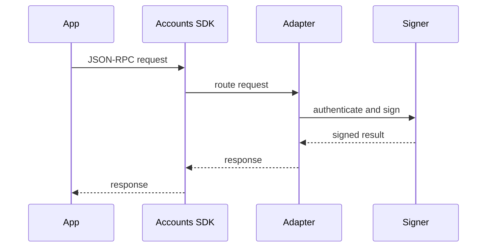

# Adapters

Adapters decide where keys live, who runs authentication, who owns account UI, and how account requests are approved. Your app talks to the Accounts SDK through one provider surface while the adapter handles signing.

| Adapter | Who owns auth | Who owns UI | Best for |
| --- | --- | --- | --- |
| [Tempo Wallet](/docs/adapters/tempo-wallet) | Tempo Wallet | Tempo Wallet hosted UI | Apps that want a universal wallet without owning auth, signing, or wallet UI infrastructure. |
| [WebAuthn](/docs/adapters/webauthn) | Your app origin | Your app | Teams that want domain-bound passkeys and Tempo account features with app-owned account UI. |
| [Custom](/docs/adapters/custom) | Your infrastructure | Your infrastructure | Privy, AWS KMS, Turnkey, internal signers, and hosted wallet products that already own user-facing surfaces. |

## How to choose

Most apps should start with Tempo Wallet because it provides hosted account creation, approval, onramp, and signing surfaces. Use WebAuthn when passkeys must be bound to your app origin and your product team can own the account, approval, recovery, and error UI. Use a custom adapter when another system already owns identity, custody, signing, or wallet UI and you want that system to plug into Tempo account features.

## Next Steps

- [Tempo Wallet](/docs/adapters/tempo-wallet)
- [WebAuthn](/docs/adapters/webauthn)
- [Custom adapter](/docs/adapters/custom)
- [Adapter API reference](/docs/api/adapters)
