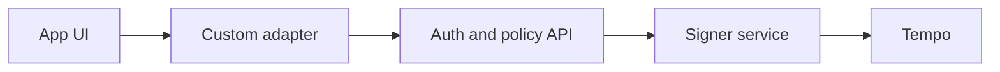

# Custom Auth

Use a custom adapter when your own infrastructure owns identity, authorization, and signing.

## Integration shape

Use this path when a first-party service already owns user identity, session state, approval UI, signing, and audit logging. The custom adapter should be the narrow boundary between the Accounts SDK provider and that service.

Target workspace for a future runnable example: `examples/enterprise-custom-auth/`.

## Integration Checklist

- Define the trust boundary between browser, server, and signer.
- Decide which service proves user intent.
- Keep signer credentials out of app code.
- Define app-owned account, approval, recovery, and error UI.
- Run the shared guide suite through the adapter.

## Reference architecture

## Review gates

- Browser code cannot bypass server authorization policy.
- Every signature is tied to user intent, session state, and audit context.
- Provider errors map to UI states the app can show.
- Shared connect, payment, spend-permission, and fee-sponsorship flows are tested.

## Next Steps

- [Custom adapter](/docs/adapters/custom)
- [Hosted Universal Wallets](/docs/enterprise/hosted-universal-wallets)
- [Authentication](/docs/guides/authentication)
