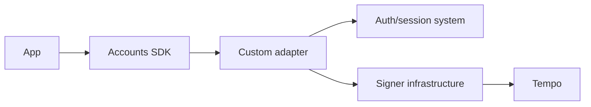

# Bring Your Auth

Bring your own authentication and signing infrastructure, then expose it to app code through an Accounts SDK adapter.

This path is for teams that already have user identity, compliance, custody, signing, or wallet UI requirements that should remain outside Tempo Wallet.

## Common patterns

| Pattern | Use it when |
| --- | --- |
| [Privy](/docs/enterprise/bring-your-auth/privy) | Privy owns app auth, wallet state, or embedded wallet UI. |
| [AWS KMS](/docs/enterprise/bring-your-auth/aws-kms) | Keys live in AWS-controlled infrastructure and approval policy is server-owned. |
| [Turnkey](/docs/enterprise/bring-your-auth/turnkey) | Turnkey owns signer infrastructure and your app provides the product UI. |
| [Custom](/docs/enterprise/bring-your-auth/custom) | Your own service owns auth, signing, wallet hosting, or user-facing approval surfaces. |

## Integration shape

## Review gates

Do not publish an enterprise integration as final guidance until these questions have concrete answers:

- Which system proves user intent?
- Which system holds or delegates keys?
- Which UI shows account creation, approval, recovery, and denial states?
- Which service owns audit logs and support workflows?
- How does the adapter map signer failures into provider errors?
- Which shared guide flows have been tested end to end?

## Next Steps

- [Custom adapter](/docs/adapters/custom)
- [Hosted Universal Wallets](/docs/enterprise/hosted-universal-wallets)
- [Spend Permissions](/docs/guides/spend-permissions)
