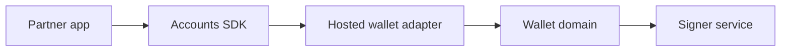

# Hosted Universal Wallets

Host a universal wallet on your own domain, then expose it to apps through a custom adapter.

Use this path when you want the portability of a wallet surface but need to own the domain, brand, auth, or signer infrastructure.

## Architecture

## Responsibilities

Hosted universal wallets are bring-your-own UI. The wallet operator owns account creation, approval, account management, recovery, and support surfaces. The Accounts SDK integration owns the adapter boundary that lets partner apps request account actions through one provider surface.

| Area | Owner |
| --- | --- |
| Wallet domain and trust model | Wallet operator |
| Account and approval UI | Wallet operator |
| Signer service and key lifecycle | Wallet operator |
| App product context before requests | Partner app |
| Adapter request translation | Wallet operator or integration team |

## Production notes

- Define whether partner apps embed the wallet in an iframe, open a popup, or redirect users to the wallet domain.
- Keep account portability explicit: what travels across apps, what stays app-local, and how recovery works.
- Document allowed origins, CSP requirements, signer availability, audit logs, and support escalation.
- Test the shared connect, payment, and spend-permission flows before onboarding partner apps.

## Next Steps

- [Custom adapter](/docs/adapters/custom)
- [Bring Your Auth](/docs/enterprise/bring-your-auth)
- [Deploying to Production](/docs/production)
